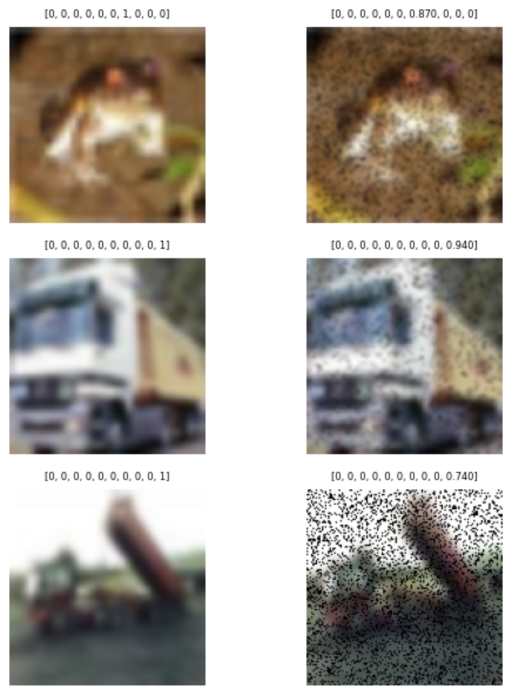
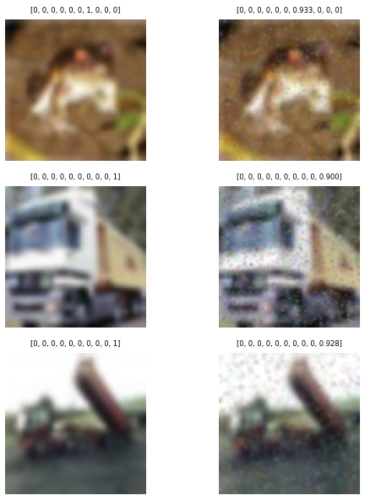
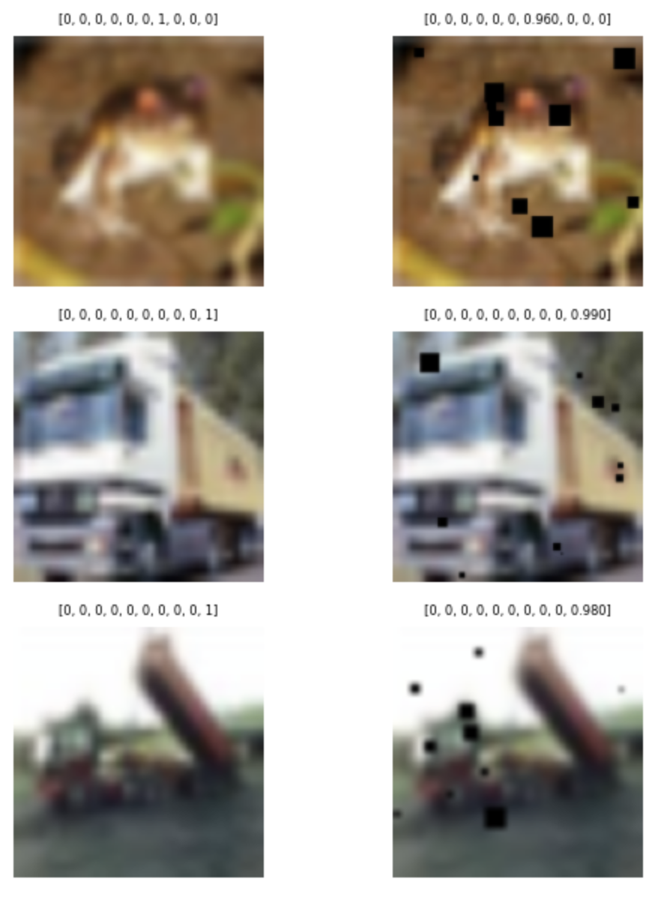
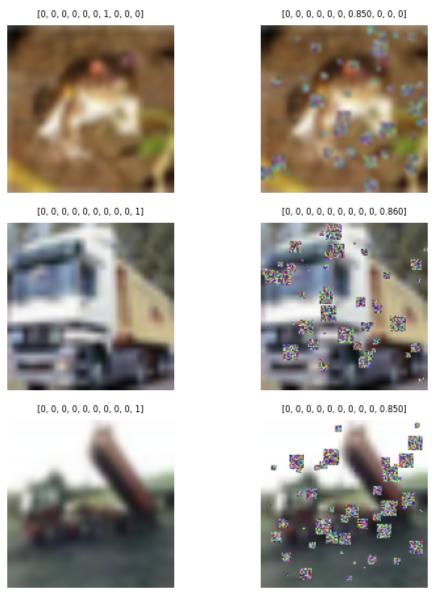
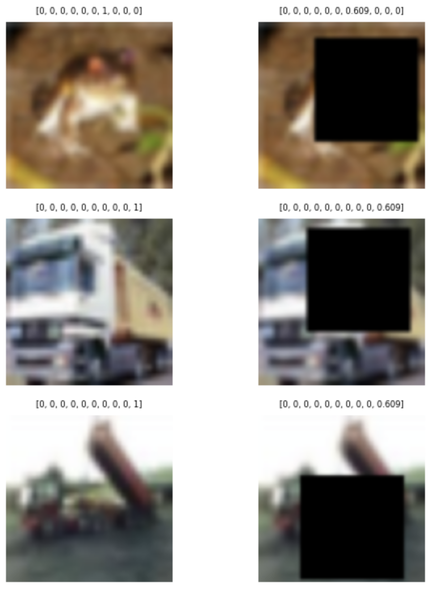
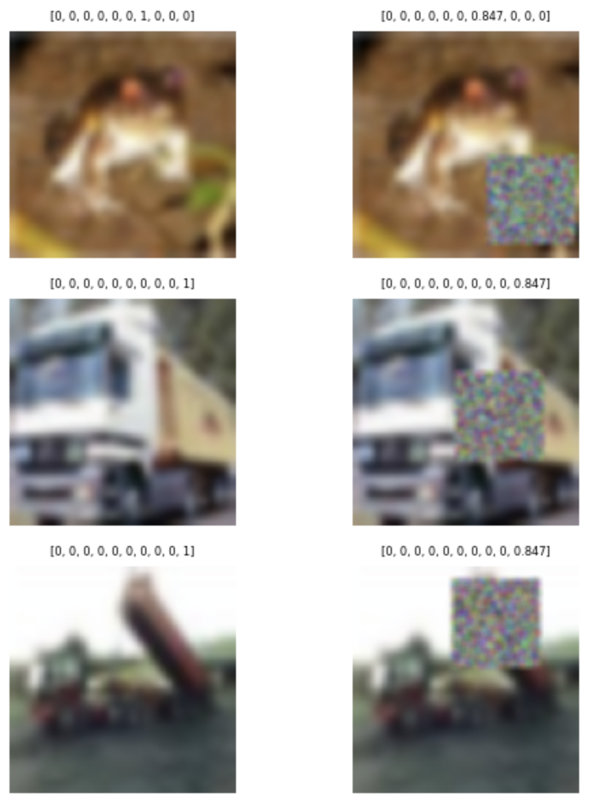
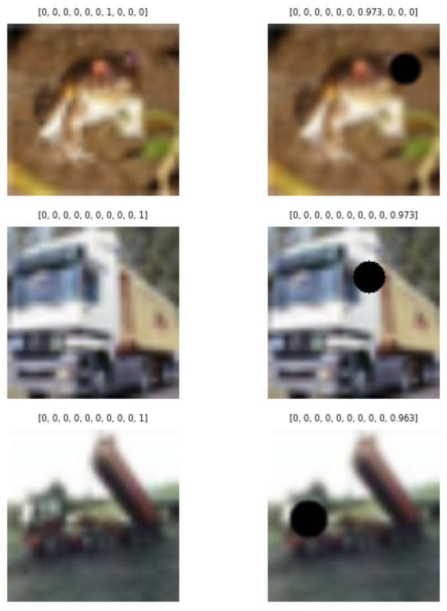
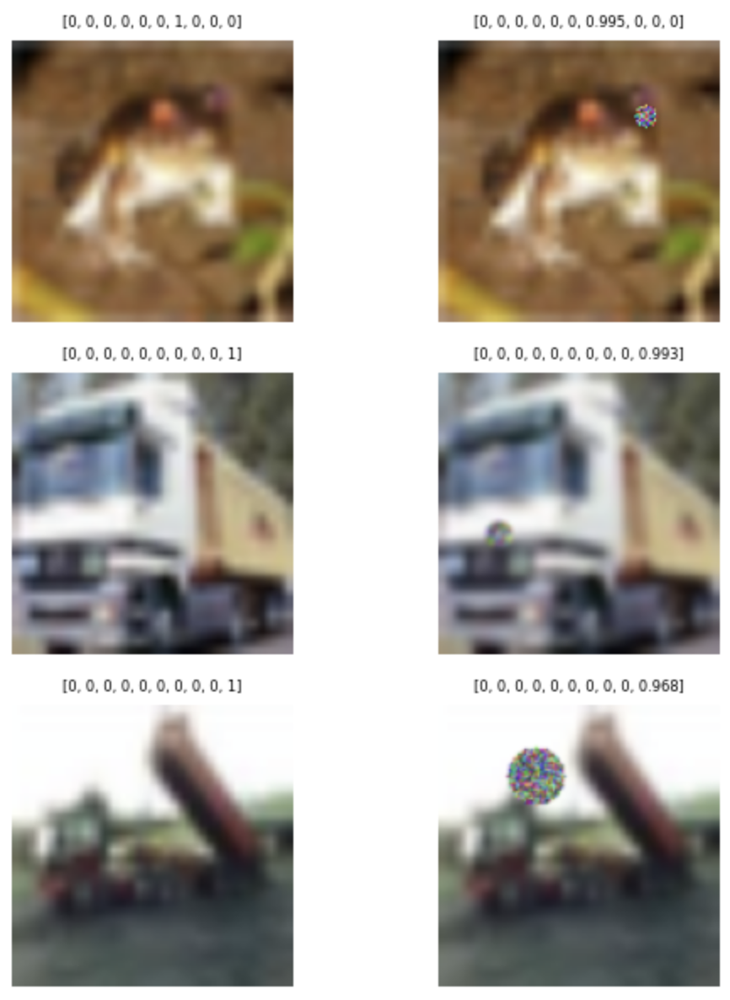
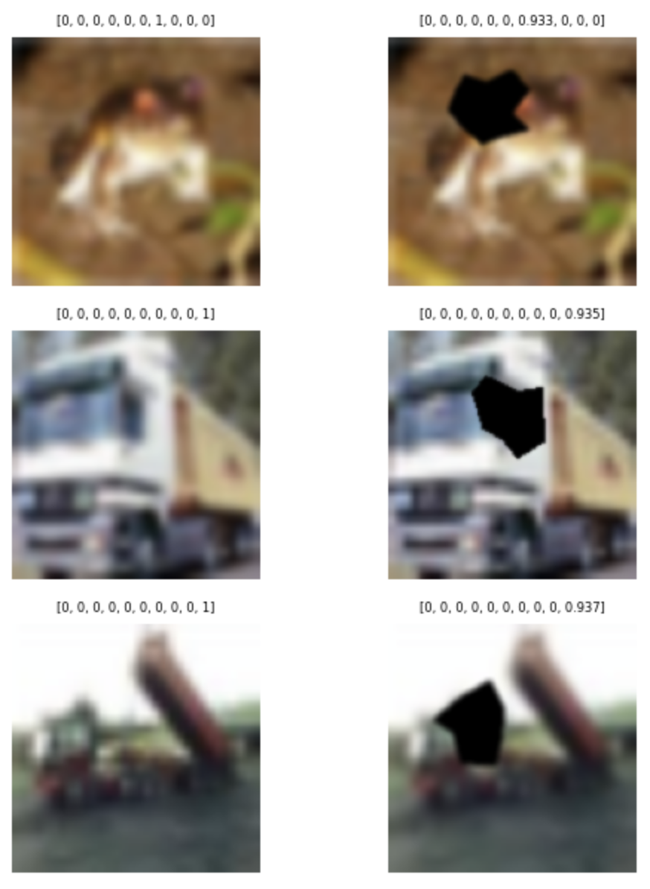
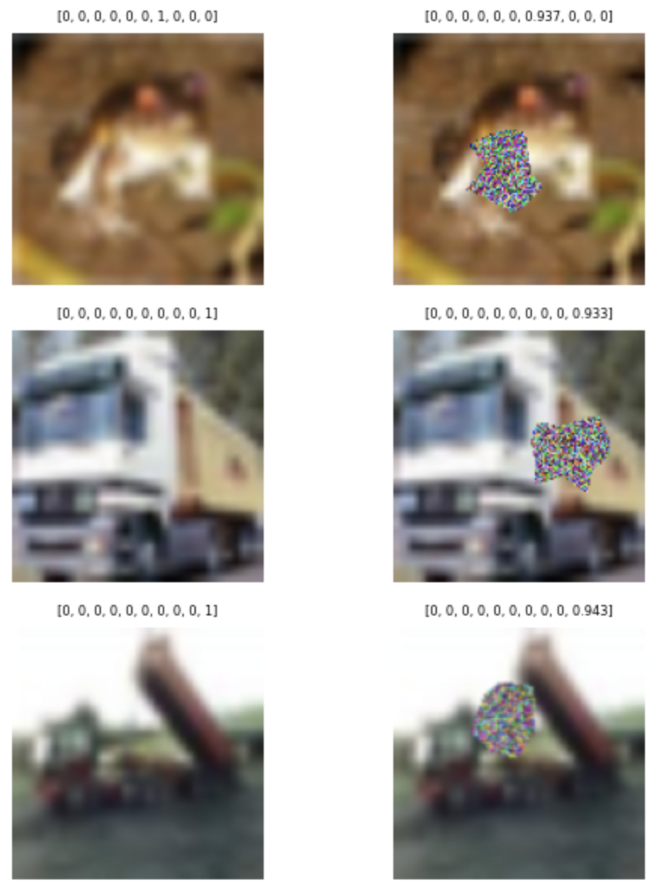

# Metody cutout w połączeniu z soft labelingiem - badanie skuteczności
## Wstęp
Celem projektu było przeprowadzenie eksperymentów mających na celu zweryfikowanie skuteczność augmentacji danych w treningu modeli. Badaną metodą augmentacji były różne sposoby cutoutu zdjęć, czyli wycinania losowych obszarów danego obrazu w celu wprowadzenia dodatkowej trudności dla modelu. Wycinanie polegało na zastąpieniu pewnej części pikseli pikselami czarnymi lub o losowych kolorach. Ta część badania inspirowana była [opublikowanymi artykułami](#bibliografia)  dotyczącymi różnych metod cutoutu i ich modyfikacjach. Z dołączonych papierów wynika, że taki sposób augmentacji danych poprawia naukę modeli, stąd motywacja na zweryfikowanie tej tezy dla różnorodnych sposobów cutoutu w naszym projekcie.

 Wyżej wspomniane metody połączono także z mechanizmem soft labeling zmieniającym etykiety klas proporcjonalnie do zakrytego pola. Inuticyjnie takie działanie powinno poprawić wyniki modelu na zbiorze walidacyjnym, ponieważ zostałby on lepiej nauczony rozpoznawania obrazów obraczonych szumem, zatem była to druga hipoteza, która została poddana ekspermentom w tym projekcie.

 ## Opis metod cutout

Zaimplementowano 5 rodzajów cutoutu - RandomPixelsCutout, RandomSquaresCutout, SquareCutout, CircleCutout, PolygonCutout oraz zmianę wejściowych etykiet na Soft Labels skalowane proporcjonalnie do powierzchni niezamaskowanego obszaru obrazu. Wszystkie metody cutoutu umożliwiają konfigurację rozmiaru i koloru wycięcia.

### Opis klas implementujących cutout

#### RandomPixelsCutout

Klasa `RandomPixelsCutout` implementuje metodę losowego zakrywania pikseli obrazu. Transformacja ta polega na losowym wyborze pikseli w obrazie i nadpisaniu ich wartością czarną lub losowym kolorem – w zależności od ustawienia parametru color.

Parametry klasy:
- **`max_cutout_size`** (*float*): Maksymalny procent pikseli, które mogą zostać zakryte (wartość z zakresu 0–1).
- **`color`** (*bool*): Jeśli `False`, zakryte piksele przyjmują kolor czarny (0,0,0). Jeśli `True`, każdy zakryty piksel otrzymuje losowy kolor RGB.
  
Metoda `__call__`:
1. Obliczana jest losowa liczba pikseli do zakrycia – maksymalnie `max_cutout_size * liczba_pikseli`.
2. Wybierane są losowe współrzędne (x, y) dla tych pikseli.
3. W zależności od ustawienia `color`, piksele są nadpisywane kolorem czarnym lub losowymi wartościami RGB.
4. Obliczana jest nowa wartość etykiety (*soft label*).

Transformacja zwraca nowy obraz oraz zaktualizowaną etykietę.

  <figure style="margin: 0; width: 45%; text-align: center;">
    
    <figcaption>RandomPixelsCutout, max_cutout_size = 0.3, color = False</figcaption>
  </figure>
  <figure style="margin: 0; width: 45%; text-align: center;">
    
    <figcaption>RandomPixelsCutout, max_cutout_size = 0.3, color = True</figcaption>
  </figure>

#### RandomSquaresCutout

Klasa `RandomSquaresCutout` implementuje wariant metody cutoutu polegający na losowym zakrywaniu obrazu kwadratowymi obszarami o jednakowym rozmiarze.

Parametry klasy:
- **`max_number_of_squares`** (*int*): Maksymalna liczba kwadratów, które mogą zostać nałożone na obraz.
- **`max_size_ratio`** (*float*): Maksymalny stosunek długości boku kwadratu do wymiaru obrazu (wartość z zakresu 0–0.1). Wyższe wartości są niedozwolone i spowodują zgłoszenie wyjątku.
- **`color`** (*bool*): Określa sposób zakrycia. Jeśli `False`, piksele w obrębie wycinka zostaną zamienione na czarne (0,0,0). Jeśli `True`, każdy piksel wewnątrz kwadratu otrzyma losowy kolor RGB.

Metoda `__call__`:
1. Losowany jest rozmiar kwadratu na podstawie proporcji `max_size_ratio`.
2. Dla każdego z `max_number_of_squares` generowane są losowe współrzędne lewego górnego rogu, w taki sposób, by kwadrat mieścił się w granicach obrazu.
3. Kwadratowe obszary są nakładane na obraz i wypełniane odpowiednim kolorem.
4. Obliczana jest nowa wartość etykiety (*soft label*).

Transformacja zwraca zmodyfikowany obraz oraz nową etykietę.

  <figure style="margin: 0; width: 45%; text-align: center;">
    
    <figcaption>RandomSquaresCutout, max_number_of_squares = 10, max_size_ratio = 0.1, color = False</figcaption>
  </figure>
  <figure style="margin: 0; width: 45%; text-align: center;">
    
    <figcaption>RandomSquaresCutout, max_number_of_squares = 50, max_size_ratio = 0.1, color = True</figcaption>
  </figure>

#### SquareCutout

Klasa `SquareCutout` implementuje metodę zakrywania jednego, kwadratowego obszaru obrazu o ustalonym rozmiarze. W odróżnieniu od wersji losowej (`RandomSquaresCutout`), ta metoda zawsze aplikuje dokładnie jedno wycięcie, którego rozmiar określany jest bezpośrednio przez użytkownika.

Parametry klasy:
- **`size`** (*int*): Rozmiar wycinanego kwadratu w pikselach (bok kwadratu). Wartość ta musi być mniejsza niż najmniejszy z wymiarów obrazu.
- **`color`** (*bool*): Określa sposób zakrycia. Jeśli `False`, piksele w obrębie wycinka zostaną zamienione na czarne (0,0,0). Jeśli `True`, każdy piksel wewnątrz kwadratu otrzyma losowy kolor RGB.

Metoda `__call__`:
1. Sprawdzana jest poprawność rozmiaru wycinka względem wymiarów obrazu – w przypadku błędu zgłaszany jest wyjątek.
2. Losowo wybierane są współrzędne lewego górnego rogu kwadratu.
3. Kwadratowy obszar o zadanym rozmiarze jest nadpisywany kolorem czarnym lub losowymi wartościami RGB.
4. Na podstawie liczby zmodyfikowanych pikseli (czyli `size²`) obliczana jest nowa etykieta (*soft label*).

Transformacja zwraca zmodyfikowany obraz oraz zaktualizowaną etykietę.

  <figure style="margin: 0; width: 45%; text-align: center;">
    
    <figcaption>RandomSquareCutout, size = 80, color = False</figcaption>
  </figure>
  <figure style="margin: 0; width: 45%; text-align: center;">
    
    <figcaption>RandomSquareCutout, size = 50, color = True</figcaption>
  </figure>

#### CircleCutout

Klasa `CircleCutout` implementuje metodę zakrywania obrazu za pomocą pojedynczego kołowego wycięcia o zmiennym promieniu.

Parametry klasy:
- **`radius`** (*int* lub *None*): Promień kołowego wycięcia w pikselach. Jeśli `None`, promień jest wybierany losowo z zakresu od 5 do wartości wyliczonej na podstawie rozmiarów obrazu i `max_size_ratio`.
- **`max_size_ratio`** (*float*): Maksymalny rozmiar wycięcia wyrażony jako ułamek mniejszego wymiaru obrazu (wartość z zakresu 0–1). Promień koła nie może przekroczyć połowy tej wartości.
- **`color`** (*tuple* RGB lub *None*): Kolor wycięcia. Domyślnie czarny `(0,0,0)`, jeśli nie zostanie podany.
- **`random_color`** (*bool*): Jeśli `True`, piksele wewnątrz koła otrzymują losowe kolory RGB zamiast jednolitego koloru.

Metoda `__call__`:
1. Ustala promień wycięcia na podstawie parametru `radius` lub losowo w dopuszczalnym zakresie.
2. Losowo wybiera środek koła tak, aby mieściło się ono w obrębie obrazu.
3. Tworzy maskę pikseli należących do koła według równania okręgu.
4. Nakłada maskę na obraz, zamieniając piksele na czarne lub losowe kolory RGB.
5. Oblicza nową etykietę (*soft label*).

Transformacja zwraca zmodyfikowany obraz oraz zaktualizowaną etykietę.

  <figure style="margin: 0; width: 45%; text-align: center;">
    
    <figcaption>CircleCutout, max_size_ratio = 0.3, color = False</figcaption>
  </figure>
  <figure style="margin: 0; width: 45%; text-align: center;">
    
    <figcaption>CircleCutout, max_size_ratio = 0.3, color = True</figcaption>
  </figure>

#### PolygonCutout

Klasa `PolygonCutout` implementuje metodę zakrywania obrazu za pomocą wycięcia w kształcie wielokąta o losowej liczbie wierzchołków.

Parametry klasy:
- **`max_vertices`** (*int*): Maksymalna liczba wierzchołków wielokąta (domyślnie 12).
- **`min_vertices`** (*int*): Minimalna liczba wierzchołków wielokąta (domyślnie 3, czyli trójkąt).
- **`max_size_ratio`** (*float*): Maksymalny rozmiar wycięcia wyrażony jako ułamek mniejszego wymiaru obrazu (wartość z zakresu 0–1).
- **`color`** (*tuple* RGB lub *None*): Kolor wycięcia. Domyślnie czarny `(0,0,0)`, jeśli nie zostanie podany.
- **`random_color`** (*bool*): Jeśli `True`, piksele wewnątrz wielokąta otrzymują losowe kolory RGB zamiast jednolitego koloru.

Metoda `__call__`:
1. Losuje liczbę wierzchołków wielokąta z zakresu od `min_vertices` do `max_vertices`.
2. Losowo wyznacza środek wielokąta oraz promień bazowy na podstawie `max_size_ratio`.
3. Generuje punkty wierzchołków wielokąta, rozmieszczone wokół środka z losowym przesunięciem kąta i odległości.
4. Sprawdza dla każdego piksela, czy znajduje się wewnątrz wielokąta, wykorzystując algorytm ray-casting.
5. Piksele znajdujące się wewnątrz wielokąta są zamieniane na wybrany kolor lub losowe kolory RGB.
6. Oblicza nową etykietę (*soft label*).

Transformacja zwraca zmodyfikowany obraz oraz zaktualizowaną etykietę.

  <figure style="margin: 0; width: 45%; text-align: center;">
    
    <figcaption>PolygonCutout, max_size_ratio = 0.3, max_vertices = 12, min_vertices = 8, color = False</figcaption>
  </figure>
  <figure style="margin: 0; width: 45%; text-align: center;">
    
    <figcaption>PolygonCutout, max_size_ratio = 0.3, max_vertices = 12, min_vertices = 8, color = True</figcaption>
  </figure>

#### SoftLabelsDataset

Klasa `SoftLabelDataset` rozszerza istniejący zbiór danych o dodatkową możliwość transformacji obrazów za pomocą cutoutu oraz modyfikacji etykiet na *soft labels*.

Parametry klasy:
- **`dataset`**: oryginalny zbiór danych, który ma być przetwarzany.
- **`pipeline_before_cutout`**: sekwencja transformacji wykonywanych na obrazach przed zastosowaniem cutoutu.
- **`pipeline_after_cutout`**: sekwencja transformacji wykonywanych po cutoucie.
- **`num_classes`** (*int*): liczba klas w zbiorze danych, używana do kodowania one-hot etykiet.
- **`cutout_transform`**: obiekt transformacji wykonujący cutout. Jeśli `None`, to cutout nie jest wykonywany, a zbiór danych nie jest rozszerzany.

Metody:
- `__len__`: zwraca rozmiar zbioru danych. Jeśli dostępny jest transformator cutoutu, zwraca podwójną długość oryginalnego zbioru (oryginalne + przekształcone obrazy).
- `__getitem__`: dla danego indeksu zwraca parę `(obraz, etykieta)`. 
  - Dla indeksów odpowiadających transformacjom cutoutu, obraz jest przetwarzany przez `cutout_transform`, a etykieta jest modyfikowana na *soft label*.
  - W przeciwnym wypadku zwraca oryginalny obraz i etykietę (zakodowaną one-hot).
  - Transformacje zdefiniowane w `pipeline_before_cutout` są wykonywane zawsze przed cutoutem, a `pipeline_after_cutout` zawsze po nim (lub zamiast, jeśli cutout nie jest stosowany).

Transformacja zwraca przetworzony obraz oraz odpowiednio zmodyfikowaną etykietę.

 ## Opis wykorzystanych danych
 W ramach projektu wykorzystano dwa zestawy danych obrazowaych: **CIFAR-10** oraz **Fashion-MNIST**. Oba zbiory należą do najczęściej stosowanych benchmarków w zadaniach klasyfikacji obrazów. 
 #### CIFAR-10
 Zbiór danych **CIFAR-10** zawiera **60 000 kolorowych obrazów RGB** o wymiarach **32×32 piksele**, podzielonych na **10 klas**:

- samolot  
- samochód  
- ptak  
- kot  
- jeleń  
- pies  
- żaba  
- koń  
- statek  
- ciężarówka

Podział zbioru:
- **50 000 obrazów treningowych**
- **10 000 obrazów testowych**

#### Fashion-MNIST

Zbiór danych **Fashion-MNIST** to nowoczesna alternatywa dla klasycznego MNIST. Zawiera **obrazy przedstawiające elementy odzieży** w odcieniach szarości o wymiarach **28×28 pikseli**, które są podzielone na **10 klas ubrań i akcesoriów**:
- T-shirt/top  
- Spodnie  
- Sweter  
- Sukienka  
- Płaszcz  
- Sandały  
- Koszula  
- Sneakersy  
- Torba  
- Botki
  
Podział zbioru:
- **60 000 obrazów treningowych**
- **10 000 obrazów testowych**

 
 ## Opis modeli
 ### Model bazowy

W eksperymencie jako model bazowy wykorzystano konwolucyjną sieć neuronową (CNN), zaprojektowaną do klasyfikacji obrazów wejściowych o takim samym kształcie jak próbki w zbiorze `X_train`. Liczba neuronów w warstwie wyjściowej (`k`) odpowiada liczbie klas i została ustalona na podstawie kształtu etykiet treningowych (`k = Y_train.shape[1]`). Architektura modelu została zbudowana w oparciu o klasyczne podejście z warstwami konwolucyjnymi, normalizacją i warstwami gęstymi.

#### Szczegóły architektury:

1. **Wejście:**
   - Obraz wejściowy o kształcie zgodnym z próbkami w `X_train`.

2. **Pierwszy blok konwolucyjny:**
   - `Conv2D(32, (3, 3), activation='relu', padding='same')`
   - `BatchNormalization()`
   - `Conv2D(32, (3, 3), activation='relu', padding='same')`
   - `BatchNormalization()`
   - `MaxPooling2D((2, 2))`

3. **Drugi blok konwolucyjny:**
   - `Conv2D(64, (3, 3), activation='relu', padding='same')`
   - `BatchNormalization()`
   - `Conv2D(64, (3, 3), activation='relu', padding='same')`
   - `BatchNormalization()`
   - `MaxPooling2D((2, 2))`

4. **Trzeci blok konwolucyjny:**
   - `Conv2D(128, (3, 3), activation='relu', padding='same')`
   - `BatchNormalization()`
   - `Conv2D(128, (3, 3), activation='relu', padding='same')`
   - `BatchNormalization()`
   - `MaxPooling2D((2, 2))`

5. **Warstwy gęste:**
   - `Flatten()`
   - `Dropout(0.25)`
   - `Dense(1024, activation='relu')`
   - `Dropout(0.25)`

6. **Warstwa wyjściowa:**
   - `Dense(k, activation='softmax')`
     
#### Wyniki modelu bazowego dla zbioru CIFAR-10

Model bazowy osiągnął następujące wyniki po 6 epokach treningu:

- **Accuracy (zbiór treningowy):** 0.8461  
- **Accuracy (zbiór testowy):** 0.8033  

#### Wyniki modelu bazowego dla zbioru Fashion-MNIST

Model bazowy osiągnął następujące wyniki po 6 epokach treningu:

- **Accuracy (zbiór treningowy):** 0.9446  
- **Accuracy (zbiór testowy):** 0.9276  

Wyniki te stanowiły za punkt odniesienia dla oceny wpływu technik **Cutout** oraz **soft labels** na jakość klasyfikacji. W kolejnych sekcjach przedstawiono, w jaki sposób te metody wpływają na skuteczność modelu w kontekście obu zbiorów danych.

 ## Analiza wyników
 ...
 ## Dodatkowe eksperymenty i testy
 ... (te 999 i wgl opis problemów że to nie tak jak miało być )
 ## Podsumowanie
 (Kasia moze napisac na koniec)

 ## Bibliografia
 1. ["Colorful Cutout"](https://arxiv.org/html/2403.20012v1 )
 2. ["Benefits of Cutout and Cutmix"](https://arxiv.org/abs/2410.23672)
